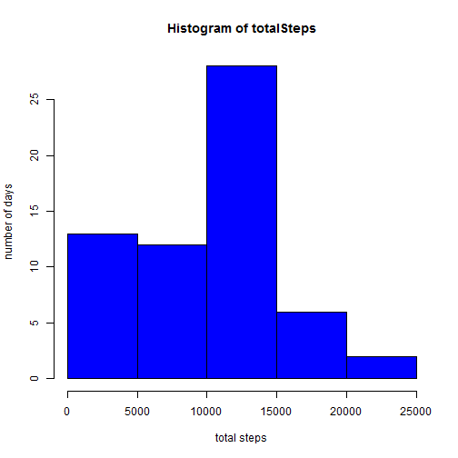
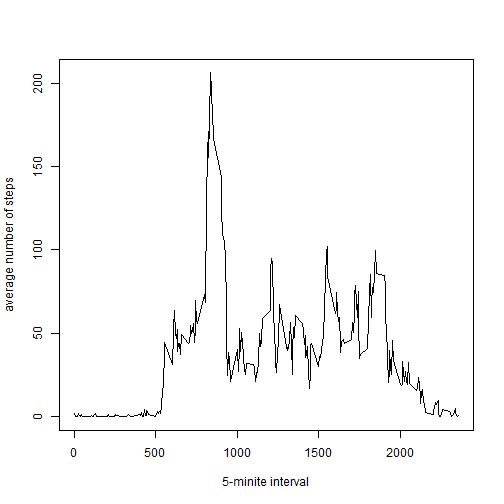
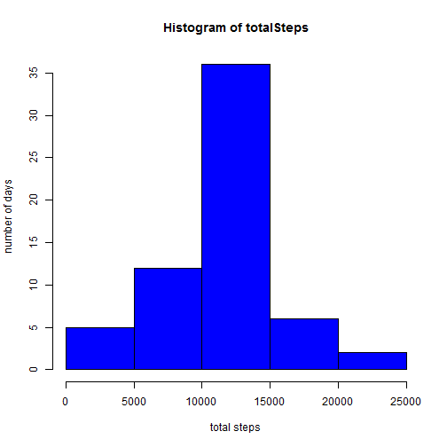
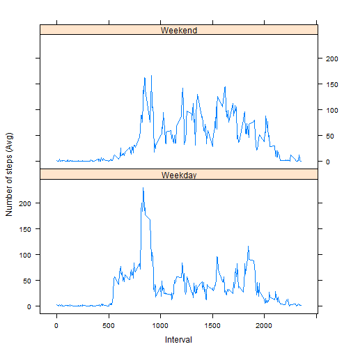

Peer Assessment 1
=================

## Acquiring Data


```r
setInternet2(TRUE)

if (is.element('repdata-data-activity.zip', dir()) == FALSE) {
  print("Loading dataset from the course web site...")
  download.file('https://d396qusza40orc.cloudfront.net/repdata%2Fdata%2Factivity.zip',
                destfile='repdata-data-activity.zip')
}
print("Unzipping dataset...")
```

```
## [1] "Unzipping dataset..."
```

```r
unzip('repdata-data-activity.zip')
```

## Loading and preprocessing the data

1. Load the data with read.csv() function.
2. Process/transform the data (if necessary).


```r
csvdata <- read.csv(file='activity.csv', header=T, na.strings="NA")
```

## What is mean total number of steps taken per day?

1. Calculate the total number of steps taken per day.

* get the subset of the data which contains only steps and date.
* use split() function for the acquired subset in order to get the step data in a day.
* use sapply() function to get the total number of steps a day.


```r
stepdata <- split(csvdata, csvdata$date)
totalSteps <- sapply(stepdata, function(x) {
  sum(x[,"steps"],na.rm=TRUE)
})
str(totalSteps)
```

```
##  Named int [1:61] 0 126 11352 12116 13294 15420 11015 0 12811 9900 ...
##  - attr(*, "names")= chr [1:61] "2012-10-01" "2012-10-02" "2012-10-03" "2012-10-04" ...
```

2. Make a histgram of the total number of steps taken per day.

```r
hist(totalSteps,xlab="total steps", ylab="number of days", col="blue")
```

 

3. Calculate and report the mean and median of the total number of steps taken per day.

* simply use summary() function to total number of steps.

```r
summary(totalSteps)
```

```
##    Min. 1st Qu.  Median    Mean 3rd Qu.    Max. 
##       0    6778   10400    9354   12810   21190
```

## What is the average daily activity pattern?
1. Make a time series plot of the 5-minute interval (x-axis) and the average number of steps taken, averaged across all days (y-axis).

* In this case, the data.frame csvdata should be splitted with interval values.


```r
stepsInterval <- split(csvdata, csvdata$interval)
averageStepsInterval <- sapply(stepsInterval, function(x){
  mean(x[,"steps"],na.rm=TRUE)
})
plot(x=as.integer(names(averageStepsInterval)), y=averageStepsInterval, type="l",
  xlab="5-minite interval", ylab="average number of steps")
```

 

2. Which 5-minute interval, on average across all the days in the dataset, contains the maximum number of steps?

* sort the list which contains the average number of steps in decreasing order.
* get the name of the first list element. 


```r
names(sort(averageStepsInterval,decreasing = T)[1])
```

```
## [1] "835"
```

## Imputing missing values

1. Calculate and report the total number of missing values in the dataset (i.e. the total number of rows with NAs)

* omit the rows which contain any NA values
* compare the number of rows between the original data.frame and the omitted one.


```r
nrow(csvdata)-nrow(na.omit(csvdata))
```

```
## [1] 2304
```

2. Devise a strategy for filling in all of the missing values in the dataset.  
3. Create a new dataset that is equal to the original dataset but with the missing data filled in.

 My strategy is as follows:
 
* substitute NAs with the average steps across all days.
* when trying to do them, the interval value of NAs is used.


```r
naIndex <- which(is.na(csvdata))
inpData <- csvdata
for (idx in naIndex) {
#  print(averageStepsInterval[as.character(inpData[idx,"interval"])])
  inpData[idx,"steps"] <- averageStepsInterval[as.character(inpData[idx,"interval"])]
}
str(inpData)
```

```
## 'data.frame':	17568 obs. of  3 variables:
##  $ steps   : num  1.717 0.3396 0.1321 0.1509 0.0755 ...
##  $ date    : Factor w/ 61 levels "2012-10-01","2012-10-02",..: 1 1 1 1 1 1 1 1 1 1 ...
##  $ interval: int  0 5 10 15 20 25 30 35 40 45 ...
```

4. Make a histogram of the total number of steps taken each day and Calculate and report the mean and median total number of steps taken per day.


```r
stepdata <- split(inpData, inpData$date)
totalSteps <- sapply(stepdata, function(x) {
  sum(x[,"steps"],na.rm=TRUE)
})
hist(totalSteps,xlab="total steps", ylab="number of days", col="blue")
```

 

```r
summary(totalSteps)
```

```
##    Min. 1st Qu.  Median    Mean 3rd Qu.    Max. 
##      41    9819   10770   10770   12810   21190
```

The histgram described above indicates that its shape looks like a standard deviation when compare to the one which was made from the original step data.Since I interpolated the average number of steps in a 5-minite interval across all days, the degree of this histgram gathered around the average steps value.

## Are there differences in activity patterns between weekdays and weekends?

1. Create a new factor variable in the dataset with two levels ??? gweekdayh and gweekendh indicating whether a given date is a weekday or weekend day.

 * Use the dataset with the filled-in missing values for this part.
 * Use weekdays() function to get the day of the week.
   Note that The place where I live is Japan, so the default locale is Japanese.
   That's why I was faced with some cumbersome problems related to locale,
   so tempolarily I changed the locale to C, and made all weekday data, and
   restored the original locale.


```r
if ("lattice" %in% installed.packages() == FALSE) {
  install.packages("lattice")
}
library(lattice)

oldLocale <- Sys.getlocale("LC_TIME")
Sys.setlocale(locale="C")
```

```
## [1] "LC_COLLATE=C;LC_CTYPE=C;LC_MONETARY=C;LC_NUMERIC=Japanese_Japan.932;LC_TIME=C"
```

```r
weekdayData <- weekdays(strptime(inpData$date, format="%Y-%m-%d"))
weekdayData <- ifelse(weekdayData != "Saturday" & weekdayData != "Sunday", "Weekday", "Weekend")
inpData$weekday <- weekdayData
str(inpData)
```

```
## 'data.frame':	17568 obs. of  4 variables:
##  $ steps   : num  1.717 0.3396 0.1321 0.1509 0.0755 ...
##  $ date    : Factor w/ 61 levels "2012-10-01","2012-10-02",..: 1 1 1 1 1 1 1 1 1 1 ...
##  $ interval: int  0 5 10 15 20 25 30 35 40 45 ...
##  $ weekday : chr  "Weekday" "Weekday" "Weekday" "Weekday" ...
```

```r
Sys.setlocale("LC_TIME", oldLocale)
```

```
## [1] "Japanese_Japan.932"
```

2. Make a panel plot containing a time series plot (i.e. type = "l") of the 5-minute interval (x-axis) and the average number of steps taken, averaged across all weekday days or weekend days (y-axis).

  * Use subset & split() functions to extract the steps data in all weekdays and
  weekends, respectively.
  * Make two data frames from the extacted data.
  * Use rbind() function to concatenate two data frames.
  * Draw a graph with lattice.
  

```r
weekdayStepsInterval <- split(inpData[inpData$weekday == "Weekday",], inpData$interval)
```

```
## Warning in split.default(x = seq_len(nrow(x)), f = f, drop = drop, ...):
## data length is not a multiple of split variable
```

```r
weekdayAveInterval <- sapply(weekdayStepsInterval, function(x){
  mean(x[,"steps"],na.rm=TRUE)
})

df1 <- data.frame(AVERAGE = weekdayAveInterval, 
                 INTERVAL = as.integer(names(weekdayAveInterval)),
                 WEEKDAY = rep("Weekday", times=length(weekdayAveInterval)))


weekendStepsInterval <- split(inpData[inpData$weekday == "Weekend",],
                              inpData$interval)
```

```
## Warning in split.default(x = seq_len(nrow(x)), f = f, drop = drop, ...):
## data length is not a multiple of split variable
```

```r
weekendAveInterval <- sapply(weekendStepsInterval, 
                             function(x) {
                               mean(x[,"steps"], na.rm=TRUE)
                               })

df2 <- data.frame(AVERAGE = weekendAveInterval,
                  INTERVAL= as.integer(names(weekendAveInterval)),
                  WEEKDAY = rep("Weekend", times=length(weekendAveInterval)))
df <- rbind(df1, df2)
xyplot(AVERAGE ~ INTERVAL|WEEKDAY, df, layout=c(1,2),type="l",xlab="Interval", ylab="Number of steps (Avg)")
```

 
